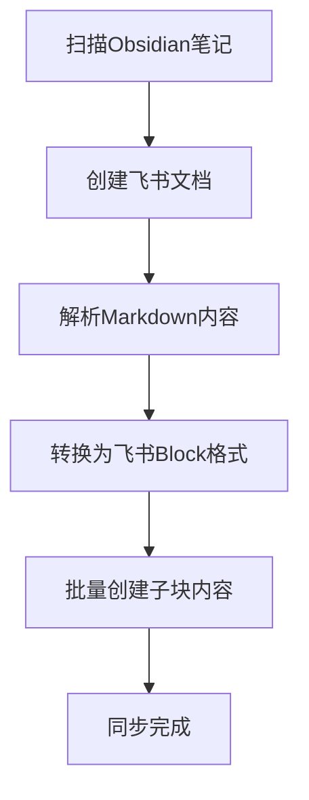
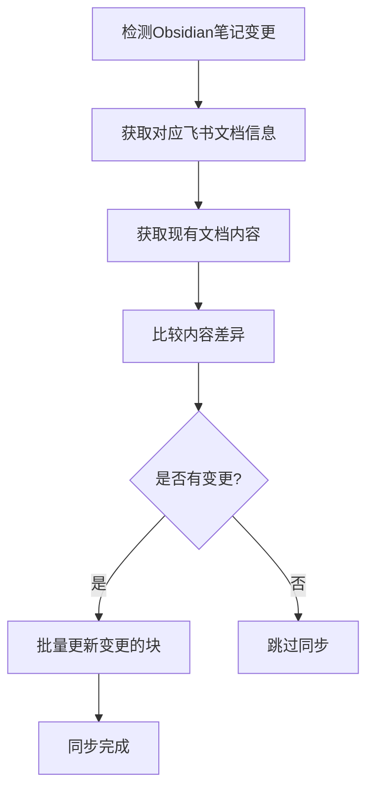

# 飞书文档API接口文档总览

本文档目录包含了Obsidian到飞书知识库同步工具所需的核心飞书API接口文档。

## 📋 API接口列表

### 核心文档操作接口

| 序号 | 接口名称 | 文件 | 功能描述 | 使用场景 |
|------|----------|------|----------|----------|
| 01 | 创建飞书文档 | [01-create-document.md](./01-create-document.md) | 创建新的飞书文档 | 为每个Obsidian笔记创建对应的飞书文档 |
| 02 | 获取文档基本信息 | [02-get-document-info.md](./02-get-document-info.md) | 获取文档标题、版本号等基本信息 | 同步前的状态检查、版本控制 |
| 03 | 获取文档所有块内容 | [03-get-document-blocks.md](./03-get-document-blocks.md) | 获取文档的完整块结构和内容 | 增量同步的内容比较 |

### 内容编辑接口

| 序号 | 接口名称 | 文件 | 功能描述 | 使用场景 |
|------|----------|------|----------|----------|
| 04 | 创建子块内容 | [04-create-child-blocks.md](./04-create-child-blocks.md) | 在文档中插入新的内容块 | 同步Obsidian笔记内容到飞书 |
| 05 | 更新特定块内容 | [05-update-block.md](./05-update-block.md) | 更新单个块的内容和样式 | 内容变更的增量同步 |
| 06 | 批量更新文档块 | [06-batch-update-blocks.md](./06-batch-update-blocks.md) | 一次性更新多个块的内容 | 提高同步效率，批量处理 |
| 07 | 删除文档块 | [07-delete-blocks.md](./07-delete-blocks.md) | 删除指定范围的块内容 | 清空文档重新同步 |

## 🔄 典型同步流程

### 新建文档同步流程


### 增量更新同步流程


## 🛠️ API使用最佳实践

### 1. 认证管理
- 使用Bearer Token认证：`Authorization: Bearer {access_token}`
- 确保token的有效期管理
- 建议使用企业自建应用获取tenant_access_token

### 2. 错误处理
- 检查HTTP状态码和响应体中的code字段
- 实现指数退避重试机制
- 处理API限流（429状态码）

### 3. 性能优化
- 优先使用批量操作接口（如批量更新块）
- 合理设置分页大小（page_size）
- 使用document_revision_id进行版本控制

### 4. 数据一致性
- 获取最新的revision_id再进行更新操作
- 使用事务性的批量操作确保数据一致性
- 实现幂等性操作，避免重复同步

## 📊 Block类型映射表

| Markdown元素 | 飞书Block类型 | block_type值 | 说明 |
|--------------|---------------|--------------|------|
| # 标题1 | heading1 | 1 | H1标题 |
| ## 标题2 | heading2 | 3 | H2标题 |
| ### 标题3 | heading3 | 4 | H3标题 |
| 普通段落 | text | 2 | 文本段落 |
| - 无序列表 | bullet | 8 | 项目符号列表 |
| 1. 有序列表 | ordered | 9 | 编号列表 |
| ```代码块``` | code | 10 | 代码块 |
| > 引用 | quote | 11 | 引用块 |
| 表格 | table | table | 表格 |

## 🔧 常用代码片段

### Python示例 - 基础API调用
```python
import requests

def call_feishu_api(method, url, headers=None, data=None):
    """飞书API调用的基础封装"""
    default_headers = {
        'Authorization': f'Bearer {access_token}',
        'Content-Type': 'application/json'
    }
    if headers:
        default_headers.update(headers)
    
    response = requests.request(method, url, headers=default_headers, json=data)
    return response.json()

# 创建文档
def create_document(folder_token=None):
    url = 'https://open.feishu.cn/open-apis/docx/v1/documents'
    if folder_token:
        url += f'?folder_token={folder_token}'
    return call_feishu_api('POST', url)

# 获取文档信息
def get_document_info(document_id):
    url = f'https://open.feishu.cn/open-apis/docx/v1/documents/{document_id}'
    return call_feishu_api('GET', url)
```

## 📝 注意事项

### API限制
- 单次批量操作最多100个块
- 分页查询最大page_size为500
- API有QPS限制，注意控制调用频率

### 数据格式
- 所有文本内容使用UTF-8编码
- 图片链接必须是可访问的HTTP/HTTPS URL
- 时间戳使用Unix毫秒格式

### 权限要求
- 需要应用具备知识库读写权限
- 文档操作需要对应的文档访问权限
- 建议使用企业自建应用以获得更好的权限控制

---

## 🔗 相关链接

- [飞书开放平台官网](https://open.feishu.cn/)
- [飞书API官方文档](https://open.feishu.cn/document/)
- [Context7飞书API参考](https://github.com/jasonqwj/feishu_api_docs)

---

*最后更新时间: 2024年12月* 